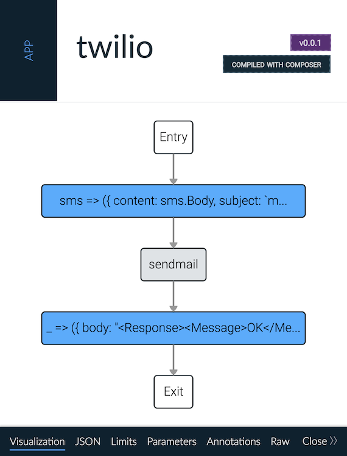

A serverless app to relay SMS messages from Twilio webhooks to email via Sendgrid. You need the [functions shell](https://www.npmjs.com/package/@ibm-functions/shell) to deploy this app to [IBM Cloud Functions](https://ibm.biz/openwhisk) or [Apache OpenWhisk](https://github.com/apache/incubator-openwhisk).

```bash
# package the sendmail action
(cd actions/sendmail; npm install; zip -r sendmail.zip index.js package.json node_modules)

# deploy the sendmail action
fsh action update sendmail actions/sendmail/sendmail.zip \
    --kind nodejs:6 \
    -p secret $SECRET \
    -p from_email $FROM_EMAIL \
    -p from_name $FROM_NAME \
    -p to_email $TO_EMAIL \
    -p to_name $TO_NAME

# deploy the application
fsh app update twilio twilio.js

# externalize a webhook for Twilio
fsh webbify twilio
```

The `webbify` command will give you the URL for your webhook. This is what you attach to your Twilio programmable SMS phone number on their dashboard.

|Composition preview showing the control flow for the app.|
|:--:|
||
